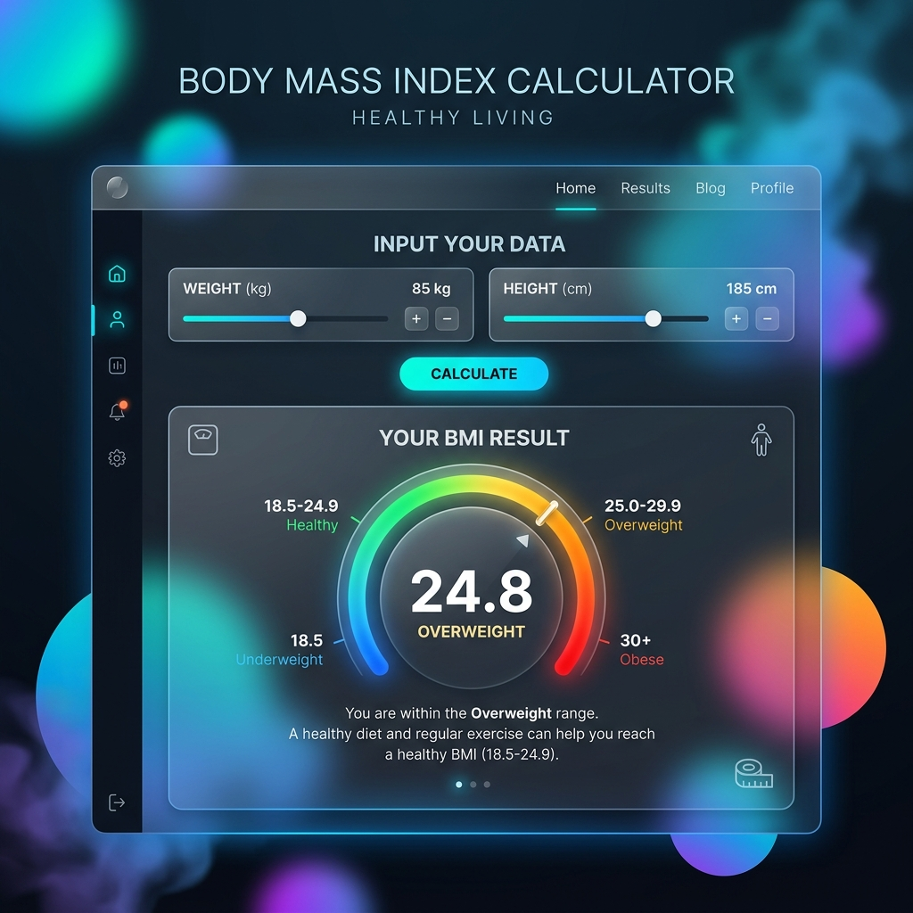

# 🌈 BMI Calculator

A premium, modern, and interactive BMI (Body Mass Index) Calculator designed with focus on user experience and sleek aesthetics. 



---

## ✨ Features

- **🚀 Real-time Calculations:** Instant BMI feedback as you input your data.
- **🎨 Modern UI:** Clean glassmorphism design with smooth transitions and vibrant background blobs.
- **📊 Visual Feedback:** Interactive BMI scale that shows exactly where you stand.
- **📱 Responsive Design:** Works perfectly on desktop, tablet, and mobile devices.
- **⚧️ Personalized Profiles:** Gender-specific cards and age input for accurate context.

## 🛠️ Developed By

This project was built from scratch by **Sunny Gill**. 

> "Creating simple solutions for complex health metrics." — Sunny Gill

---

## 💻 Tech Stack

- **HTML5:** Semantic structure for maximum accessibility.
- **CSS3:** Advanced animations, CSS Grid/Flexbox, and Glassmorphism effects.
- **JavaScript (ES6+):** Pure vanilla JS for lightning-fast performance and logic.

## 🚀 Getting Started

Follow these simple steps to get the project running locally on your machine:

### 1. Project Setup
Download the project files to your local machine.

### 2. Launch
Since this is a client-side application, you can simply open the `index.html` file in any modern web browser.

```bash
# Recommended: Use a live server (optional)
live-server .
```

## 📈 How it Works

The Body Mass Index (BMI) is a simple index of weight-for-height that is commonly used to classify underweight, overweight and obesity in adults. It is defined as the weight in kilograms divided by the square of the height in metres (kg/m²).

| BMI Range | Category |
| :--- | :--- |
| < 18.5 | Underweight |
| 18.5 – 24.9 | Normal Weight |
| 25.0 – 29.9 | Overweight |
| > 30.0 | Obesity |

---

## 📄 License
This project is open-source. Feel free to use and modify it as you see fit!

---
*Created with ❤️ by [Sunny Gill](https://github.com/itzsunnygill)*
